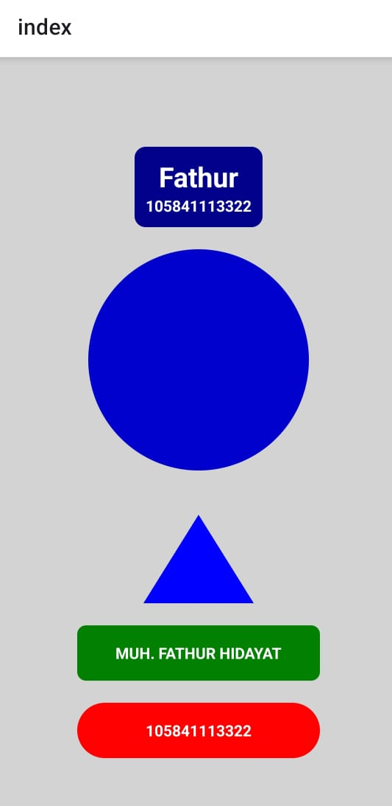

# Lab AKB (Aplikasi Komputasi Bergerak)

 

## ✨ Fitur Utama

-   Menampilkan bentuk Segitiga, Lingkaran, dan Persegi Panjang.
-   Menampilkan Nama dan Nomor Induk Mahasiswa dalam elemen yang berbeda.
-   Desain dengan layout yang seimbang dan kontras warna yang baik.

## 📸 Tampilan Aplikasi

Berikut adalah tampilan akhir dari aplikasi.




## 🛠️ Teknologi yang Digunakan

-   **React Native**: Kerangka kerja utama untuk membangun aplikasi.
-   **Expo**: Platform untuk mempermudah pengembangan dan build aplikasi React Native.
-   **TypeScript**: Digunakan untuk *static typing*, membuat kode lebih aman dan mudah dikelola.

## ⚙️ Instalasi & Menjalankan Proyek

Berikut adalah langkah-langkah untuk menjalankan proyek ini di lingkungan pengembangan lokal Anda.

1.  **Clone repository**

    ```bash
    git clone [https://github.com/Fathur0146/Lab_AKB.git](https://github.com/Fathur0146/Lab_AKB.git)
    ```

2.  **Masuk ke direktori proyek**

    ```bash
    cd Lab_AKB
    ```

3.  **Install semua dependency**

    ```bash
    npm install
    ```

4.  **Jalankan aplikasi**

    ```bash
    npx expo start
    ```

    > **Catatan:** Perintah `npm start` juga akan berfungsi karena sudah diatur dalam file `package.json`.

    Setelah menjalankan perintah di atas, akan muncul QR code. Pindai QR code tersebut menggunakan aplikasi **Expo Go** di ponsel Anda.

## 📂 Struktur Folder

Berikut adalah struktur folder utama dalam proyek ini:

-   **/app**: Berisi semua layar dan logika navigasi aplikasi. Menggunakan sistem *file-based routing* dari Expo Router.
-   **/assets**: Tempat menyimpan file statis seperti gambar, ikon, dan font.
-   **app.json**: File konfigurasi utama untuk aplikasi Expo, tempat mengatur nama, ikon, splash screen, dll.
-   **package.json**: Mencatat semua skrip (`npm start`) dan dependensi (library) yang digunakan proyek.
-   **tsconfig.json**: Mengatur konfigurasi untuk compiler TypeScript pada proyek ini.

## 📄 Lisensi

Proyek ini didistribusikan di bawah Lisensi MIT.