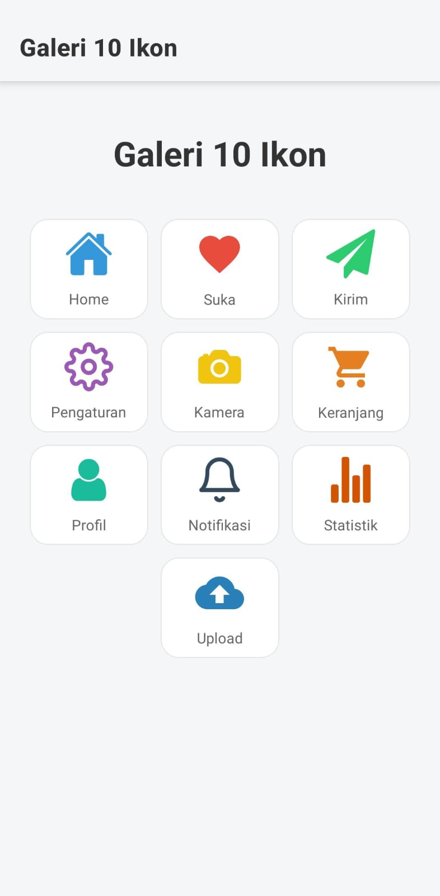

# Galeri Ikon - Tugas Expo

Sebuah aplikasi sederhana yang dibuat dengan React Native (Expo) untuk menampilkan galeri 10 ikon berbeda dari pustaka `@expo/vector-icons`. Proyek ini mendemonstrasikan cara mengimpor dan menata beberapa ikon dalam tata letak grid yang rapi dan responsif.

---

## 📸 Tangkapan Layar



---

## ✨ Fitur Utama

-   Menampilkan **10 ikon unik** dari berbagai keluarga ikon, termasuk `Ionicons`, `MaterialCommunityIcons`, `FontAwesome`, dan `Feather`.
-   Tata letak **grid yang rapi** dan responsif, menampilkan 3 ikon per baris yang secara otomatis menyesuaikan diri.
-   Setiap ikon dilengkapi dengan **label** teks yang jelas untuk identifikasi.
-   Menggunakan **Expo Router** untuk mengatur layout dan judul halaman pada *header* aplikasi.
-   Tampilan yang aman dan konsisten di berbagai perangkat berkat penggunaan `ScrollView` dan `SafeAreaView`.

---

## 🚀 Teknologi yang Digunakan

-   **React Native**: Kerangka kerja utama untuk membangun aplikasi.
-   **Expo**: Platform untuk mempermudah pengembangan dan build aplikasi React Native.
-   **Expo Router**: Sistem navigasi berbasis file untuk mengatur halaman dan layout.
-   **TypeScript**: Menambahkan tipe statis pada JavaScript.
-   **`@expo/vector-icons`**: Pustaka untuk mengakses ribuan ikon siap pakai.

---

## 📂 Struktur Proyek

```
/
├── app/                # Direktori utama untuk halaman (Expo Router)
│   ├── _layout.tsx     # Konfigurasi layout global dan header aplikasi
│   └── index.tsx       # Halaman utama yang menampilkan galeri ikon
└── README.md           # File ini
```
-   **`app/index.tsx`**: Berisi semua logika dan komponen untuk menampilkan 10 ikon dalam sebuah grid.
-   **`app/_layout.tsx`**: Mengonfigurasi `Stack` navigator dari Expo Router dan mengatur judul serta gaya pada *header* aplikasi.

---

## ⚙️ Instalasi dan Menjalankan

Untuk menjalankan proyek ini di lingkungan lokal Anda, ikuti langkah-langkah berikut:

1.  **Clone Repositori**
    ```bash
    git clone [https://github.com/Fathur0146/Lab_AKB.git]
    ```

2.  **Masuk ke Direktori Proyek**
    ```bash
    cd [Lab_AKB]
    ```

3.  **Install Dependencies**
    ```bash
    npm install
    ```
    _Atau jika Anda menggunakan Yarn:_
    ```bash
    yarn install
    ```

4.  **Jalankan Aplikasi**
    ```bash
    npx expo start
    ```
    Setelah itu, pindai kode QR yang muncul menggunakan aplikasi Expo Go di perangkat seluler Anda.

---

## 👨‍💻 Dibuat oleh

-   **Nama**: [Muh. Fathur Hidayat]
-   **NIM**: [105841113322]